# Практическое задание по занятию "Оркестрация группой Docker контейнеров на примере Docker Compose."

## Задача 1
* Предоставьте ответ в виде ссылки на https://hub.docker.com/<username_repo>/custom-nginx/general .
    
    https://hub.docker.com/repository/docker/dim22/custom-nginx/general

## Задача 2
1. Запустите ваш образ custom-nginx:1.0.0 командой docker run в соответвии с требованиями:
* имя контейнера "ФИО-custom-nginx-t2"
* контейнер работает в фоне
* контейнер опубликован на порту хост системы 127.0.0.1:8080
2. Не удаляя, переименуйте контейнер в "custom-nginx-t2"
3.  Выполните команду
```bash
   date +"%d-%m-%Y %T.%N %Z" ; sleep 0.150 ; docker ps ; ss -tlpn | grep 127.0.0.1:8080  ; docker logs custom-nginx-t2 -n1 ; docker exec -it custom-nginx-t2 base64 /usr/share/nginx/html/index.html
```
4.  Убедитесь с помощью curl или веб браузера, что индекс-страница доступна.

В качестве ответа приложите скриншоты консоли, где видно все введенные команды и их вывод.

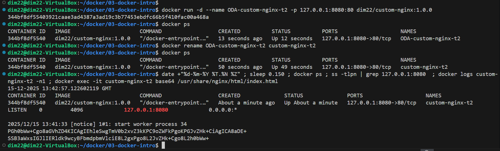

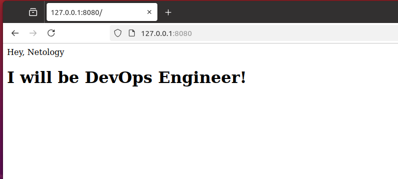

## Задача 3

1. Воспользуйтесь docker help или google, чтобы узнать как подключиться к стандартному потоку ввода/вывода/ошибок контейнера "custom-nginx-t2".
2. Подключитесь к контейнеру и нажмите комбинацию Ctrl-C.
3. Выполните docker ps -a и объясните своими словами почему контейнер остановился.
   
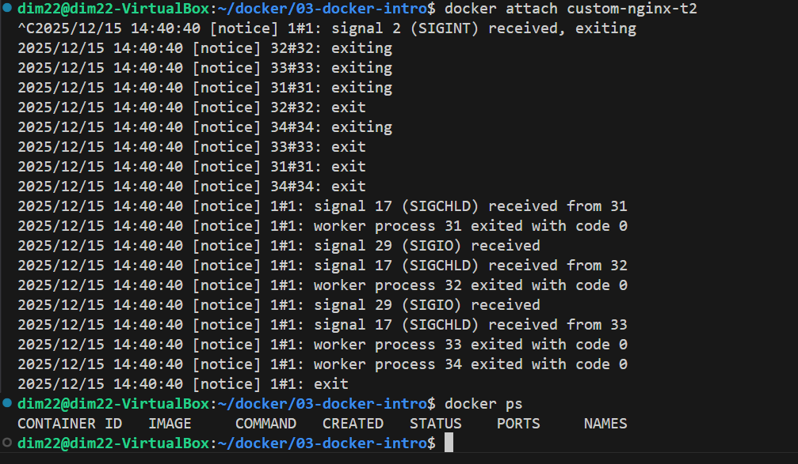
```txt
Нажав Ctrl-C я отправил приложению в контейнере сигнал SIGINT и завершил его работу. 
После выключения приложения контейнер остановился.
```
4. Перезапустите контейнер
5. Зайдите в интерактивный терминал контейнера "custom-nginx-t2" с оболочкой bash.
6. Установите любимый текстовый редактор(vim, nano итд) с помощью apt-get.

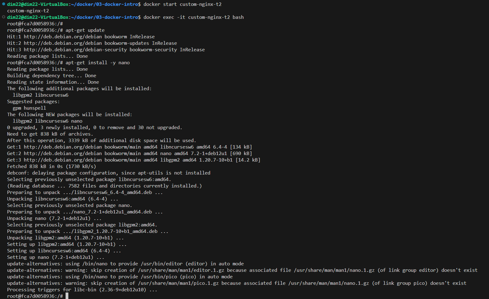

7. Отредактируйте файл "/etc/nginx/conf.d/default.conf", заменив порт "listen 80" на "listen 81".

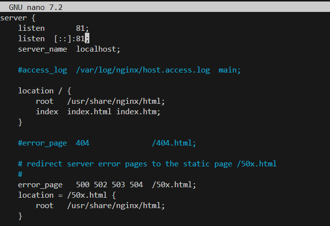

8. Запомните(!) и выполните команду nginx -s reload, а затем внутри контейнера curl http://127.0.0.1:80 ; curl http://127.0.0.1:81.

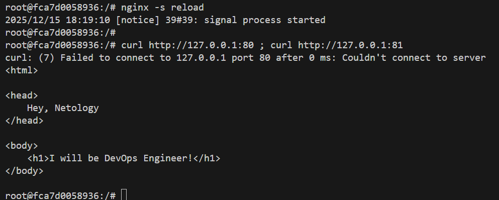

9. Выйдите из контейнера, набрав в консоли exit или Ctrl-D.
10. Проверьте вывод команд: ss -tlpn | grep 127.0.0.1:8080 , docker port custom-nginx-t2, curl http://127.0.0.1:8080. Кратко объясните суть возникшей проблемы.

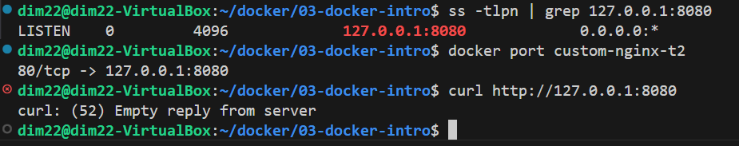
```txt
При создании был проброшен порт контейнера 80 на порт хоста 8080. 
В пункте 7 задания мы вручную, в контейнере поменяли порт  nginx на 81. 
Правильно было пересоздать контейнер с параметром p 127.0.0.1:8080:81
```
11.  Попробуйте самостоятельно исправить конфигурацию контейнера, используя доступные источники в интернете. Не изменяйте конфигурацию nginx и не удаляйте контейнер. Останавливать контейнер можно.
  
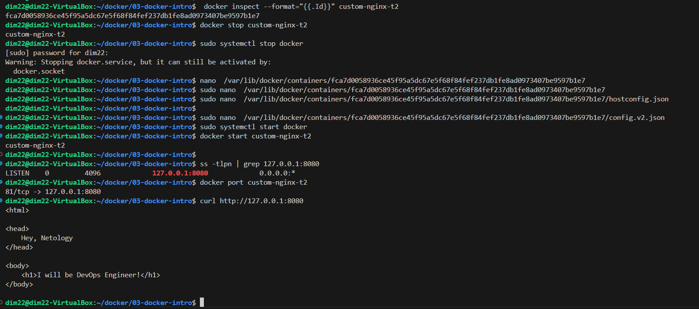

12.  Удалите запущенный контейнер "custom-nginx-t2", не останавливая его.

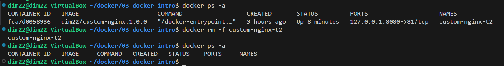

## Задача 4
1. Запустите первый контейнер из образа centos c любым тегом в фоновом режиме, подключив папку текущий рабочий каталог $(pwd) на хостовой машине в /data контейнера, используя ключ -v.
2. Запустите второй контейнер из образа debian в фоновом режиме, подключив текущий рабочий каталог $(pwd) в /data контейнера.
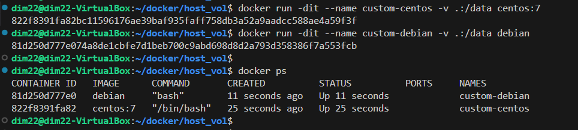

3. Подключитесь к первому контейнеру с помощью docker exec и создайте текстовый файл любого содержания в /data.
4. Добавьте ещё один файл в текущий каталог $(pwd) на хостовой машине.
5. Подключитесь во второй контейнер и отобразите листинг и содержание файлов в /data контейнера.
6. В качестве ответа приложите скриншоты консоли, где видно все введенные команды и их вывод.
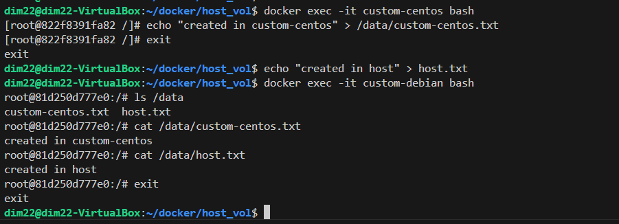

## Задача 5
1. Создайте отдельную директорию(например /tmp/netology/docker/task5) и 2 файла внутри него. "compose.yaml", "docker-compose.yaml". И выполните команду "docker compose up -d". Какой из файлов был запущен и почему?
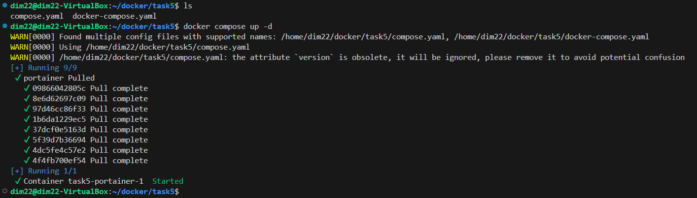
```txt
При выполнении команды "docker compose up -d" запустился файл compose.yaml, т.к. он является предпочтительным. 
Если существуют оба варианта "compose.yaml" и "docker-compose.yaml",  Compose выберет compose.yaml.
```
2. Отредактируйте файл compose.yaml так, чтобы были запущенны оба файла.
```yml
version: "3"
services:
  portainer:
    network_mode: host
    image: portainer/portainer-ce:latest
    volumes:
      - /var/run/docker.sock:/var/run/docker.sock

include:
  - docker-compose.yaml
```
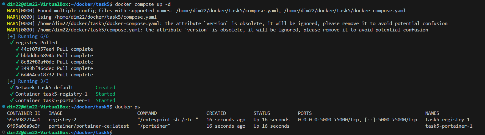

3. Выполните в консоли вашей хостовой ОС необходимые команды чтобы залить образ custom-nginx как custom-nginx:latest в запущенное вами, локальное registry.
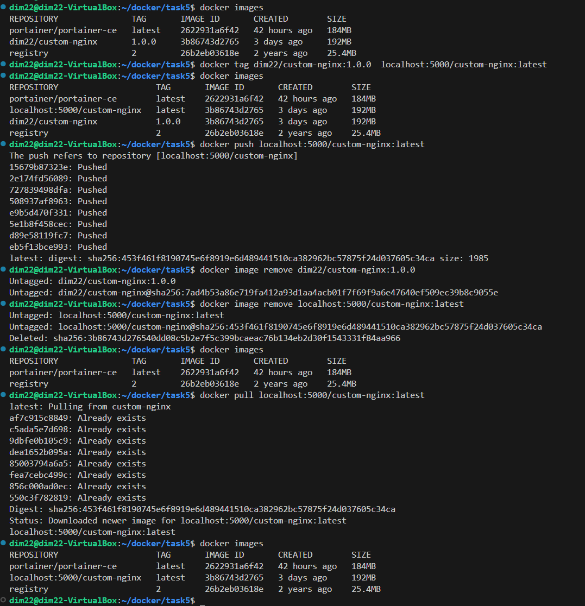

4. Откройте страницу "https://127.0.0.1:9000" и произведите начальную настройку portainer.(логин и пароль адмнистратора)

5. Откройте страницу "http://127.0.0.1:9000/#!/home", выберите ваше local окружение. Перейдите на вкладку "stacks" и в "web editor" задеплойте следующий компоуз
```yml
version: '3'

services:
  nginx:
    image: 127.0.0.1:5000/custom-nginx
    ports:
      - "9090:80"
```
6. Перейдите на страницу "http://127.0.0.1:9000/#!/2/docker/containers", выберите контейнер с nginx и нажмите на кнопку "inspect". В представлении <> Tree разверните поле "Config" и сделайте скриншот от поля "AppArmorProfile" до "Driver".
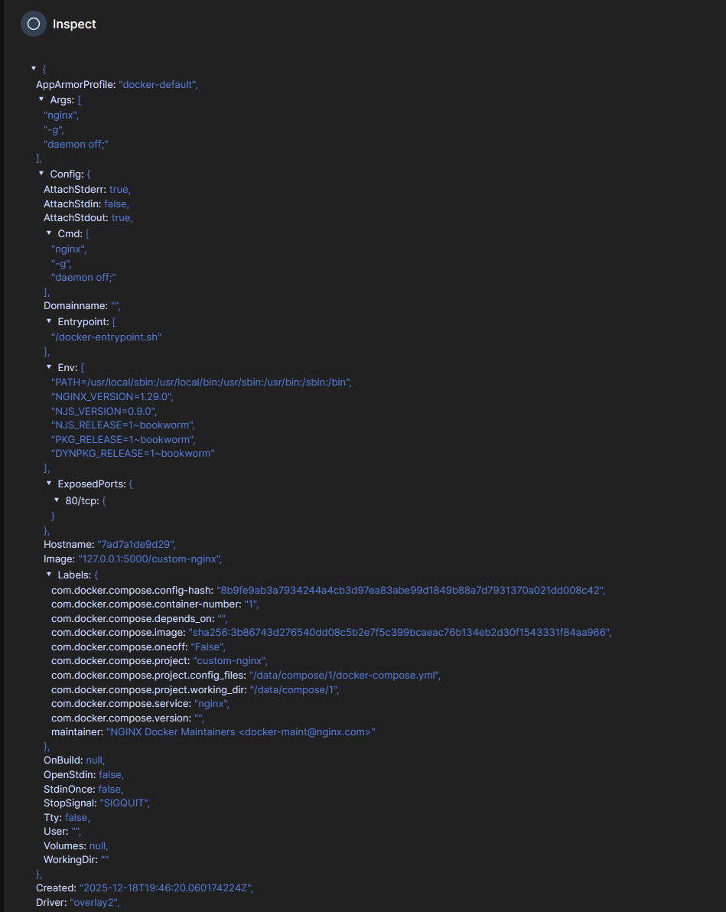

7. Удалите любой из манифестов компоуза(например compose.yaml). Выполните команду "docker compose up -d". Прочитайте warning, объясните суть предупреждения и выполните предложенное действие. (обязательно!!) командой.
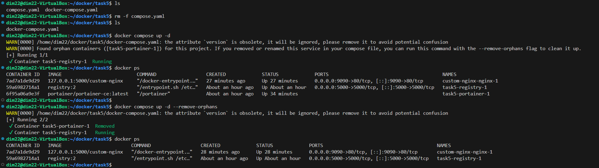
```txt
Предупреждение означает, что найдены контейнеры не описанные в проекте 
и предлагает очистить эти контейнеры с помощью флага --remove-orphans
```
Погасите compose-проект ОДНОЙ (обязательно!!) командой.
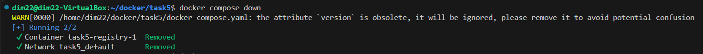

В качестве ответа приложите скриншоты консоли, где видно все введенные команды и их вывод, файл compose.yaml , скриншот portainer c задеплоенным компоузом.
```yml
version: "3"
services:
  portainer:
    network_mode: host
    image: portainer/portainer-ce:latest
    volumes:
      - /var/run/docker.sock:/var/run/docker.sock

include:
  - docker-compose.yaml
```
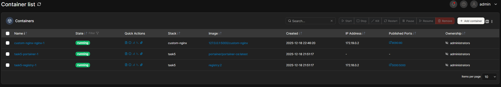