# Практическое задание по занятию "Практическое применение Docker"

## Задача 1
1. Сделайте в своем GitHub пространстве fork репозитория.
* https://github.com/Dim223/shvirtd-example-python#
2. Создайте файл Dockerfile.python на основе существующего Dockerfile:
* Используйте базовый образ python:3.12-slim
* Обязательно используйте конструкцию COPY . . в Dockerfile
* Создайте .dockerignore файл для исключения ненужных файлов
```docker
.git
.env
*.yaml
*.pdf
Dockerfile
LICENSE
README.md
```
* Используйте CMD ["uvicorn", "main:app", "--host", "0.0.0.0", "--port", "5000"] для запуска
```docker
FROM python:3.12-slim
WORKDIR /app
COPY requirements.txt ./
RUN pip install --no-cache-dir -r requirements.txt
COPY . .
CMD ["uvicorn", "main:app", "--host", "0.0.0.0", "--port", "5000"] 
```
* Протестируйте корректность сборки
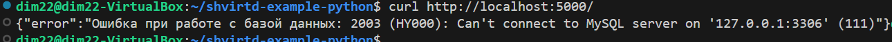
4. (Необязательная часть, *) Изучите код приложения и добавьте управление названием таблицы через ENV переменную.
```python
В блоке # --- 1. Конфигурация ---
Добавляем переменную:
db_table = os.environ.get('DB_TABLE', 'example')
Далее в коде приложения меняем requests на db_table
В .env добавляем
MYSQL_TABLE="requests"
В compose.yaml, в environment сервиса web добавляем 
      - DB_TABLE=${MYSQL_TABLE}
```

## Задача 2 (*)
1. Создайте в yandex cloud container registry с именем "test" с помощью "yc tool" . 
2. Настройте аутентификацию вашего локального docker в yandex container registry.
3. Соберите и залейте в него образ с python приложением из задания №1.
4. Просканируйте образ на уязвимости.
5. В качестве ответа приложите отчет сканирования.
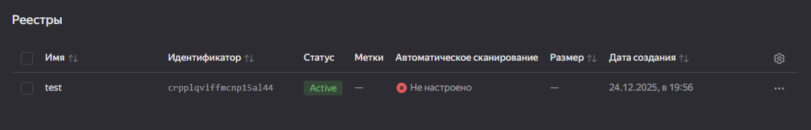

[Отчет сканирования](images/vulnerabilities.csv)

## Задача 3
1. Изучите файл "proxy.yaml"
2. Создайте в репозитории с проектом файл compose.yaml. С помощью директивы "include" подключите к нему файл "proxy.yaml".
3. Опишите в файле compose.yaml следующие сервисы:
* web. Образ приложения должен ИЛИ собираться при запуске compose из файла Dockerfile.python ИЛИ скачиваться из yandex cloud container registry(из задание №2 со *). Контейнер должен работать в bridge-сети с названием backend и иметь фиксированный ipv4-адрес 172.20.0.5. Сервис должен всегда перезапускаться в случае ошибок. Передайте необходимые ENV-переменные для подключения к Mysql базе данных по сетевому имени сервиса web

* db. image=mysql:8. Контейнер должен работать в bridge-сети с названием backend и иметь фиксированный ipv4-адрес 172.20.0.10. Явно перезапуск сервиса в случае ошибок. Передайте необходимые ENV-переменные для создания: пароля root пользователя, создания базы данных, пользователя и пароля для web-приложения.Обязательно используйте уже существующий .env file для назначения секретных ENV-переменных!
```docker
version: '3.8'

include:
  - proxy.yaml

services:

  web:
    build:
      context: .
      dockerfile: Dockerfile.python
    
    restart: always
    environment:
      - DB_HOST=db
      - DB_NAME=${MYSQL_DATABASE}
      - DB_USER=${MYSQL_USER}
      - DB_PASSWORD=${MYSQL_PASSWORD}
    depends_on:
      db:
        condition: service_healthy
    expose:
      - 5000
    networks:
      backend:
        ipv4_address: 172.20.0.5

  db:
    image: mysql:8
    restart: always
    environment:
      - MYSQL_ROOT_PASSWORD=${MYSQL_ROOT_PASSWORD}
      - MYSQL_DATABASE=${MYSQL_DATABASE}
      - MYSQL_USER=${MYSQL_USER}
      - MYSQL_PASSWORD=${MYSQL_PASSWORD}
    volumes:
      - db_data:/var/lib/mysql
    expose:
      - 3306
    healthcheck:
      test: ["CMD", "mysqladmin", "ping", "-h", "localhost"]
      timeout: 20s
      retries: 10
    networks:
      backend:
        ipv4_address: 172.20.0.10

networks:
  backend:
    driver: bridge
    ipam:
      config:
        - subnet: 172.20.0.0/24

volumes:
  db_data:
```
4. Запустите проект локально с помощью docker compose , добейтесь его стабильной работы: команда curl -L http://127.0.0.1:8090 должна возвращать в качестве ответа время и локальный IP-адрес. Если сервисы не стартуют воспользуйтесь командами: docker ps -a  и docker logs <container_name> . Если вместо IP-адреса вы получаете информационную ошибку --убедитесь, что вы шлете запрос на порт 8090, а не 5000.
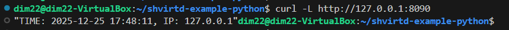

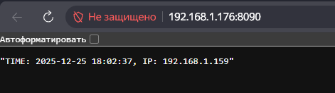

5. Подключитесь к БД mysql с помощью команды docker exec -ti <имя_контейнера> mysql -uroot -p<пароль root-пользователя>(обратите внимание что между ключем -u и логином root нет пробела. это важно!!! тоже самое с паролем) . Введите последовательно команды (не забываем в конце символ ; ): show databases; use <имя вашей базы данных(по-умолчанию example)>; show tables; SELECT * from requests LIMIT 10;.
6. Остановите проект. В качестве ответа приложите скриншот sql-запроса.
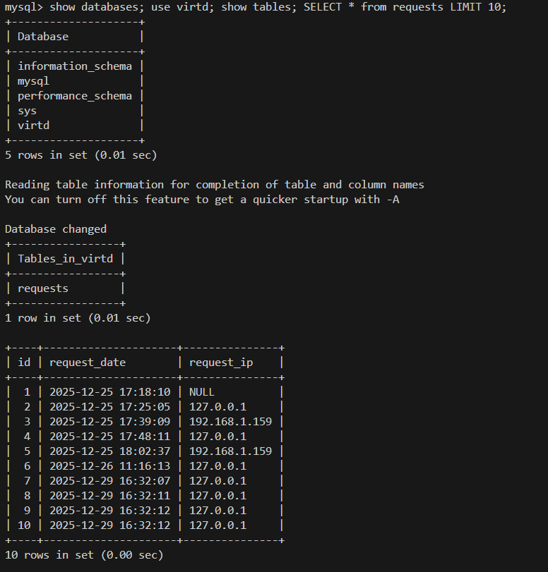

## Задача 4
1. Запустите в Yandex Cloud ВМ (вам хватит 2 Гб Ram).
2. Подключитесь к Вм по ssh и установите docker.
3. Напишите bash-скрипт, который скачает ваш fork-репозиторий в каталог /opt и запустит проект целиком.

[Скрипт](images/gitclon.sh)

4. Зайдите на сайт проверки http подключений, например(или аналогичный): https://check-host.net/check-http и запустите проверку вашего сервиса http://<внешний_IP-адрес_вашей_ВМ>:8090. Таким образом трафик будет направлен в ingress-proxy. Трафик должен пройти через цепочки: Пользователь → Internet → Nginx → HAProxy → FastAPI(запись в БД) → HAProxy → Nginx → Internet → Пользователь
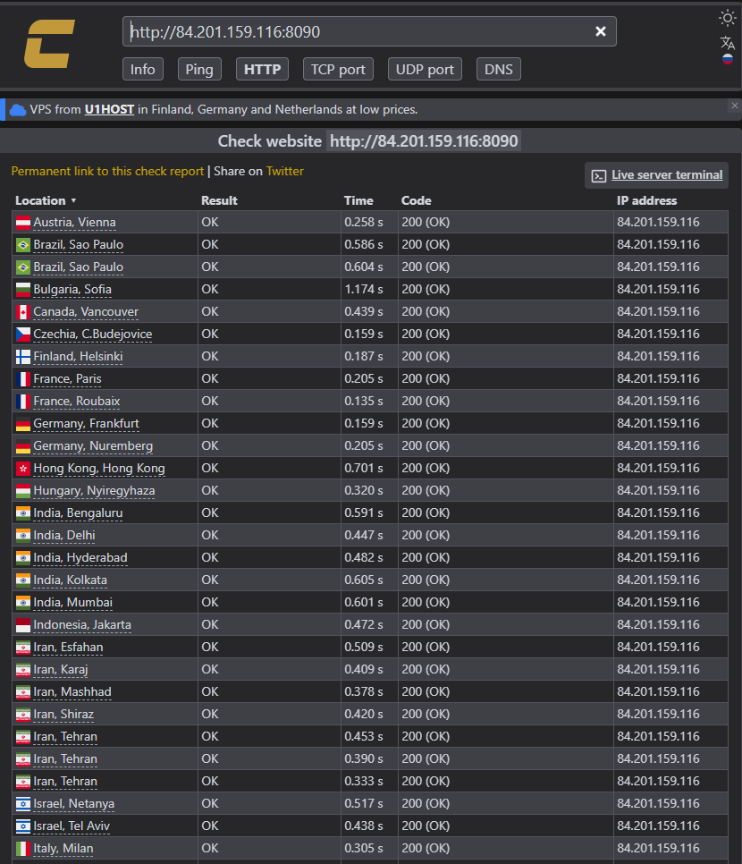


6. Повторите SQL-запрос на сервере и приложите скриншот и ссылку на fork.
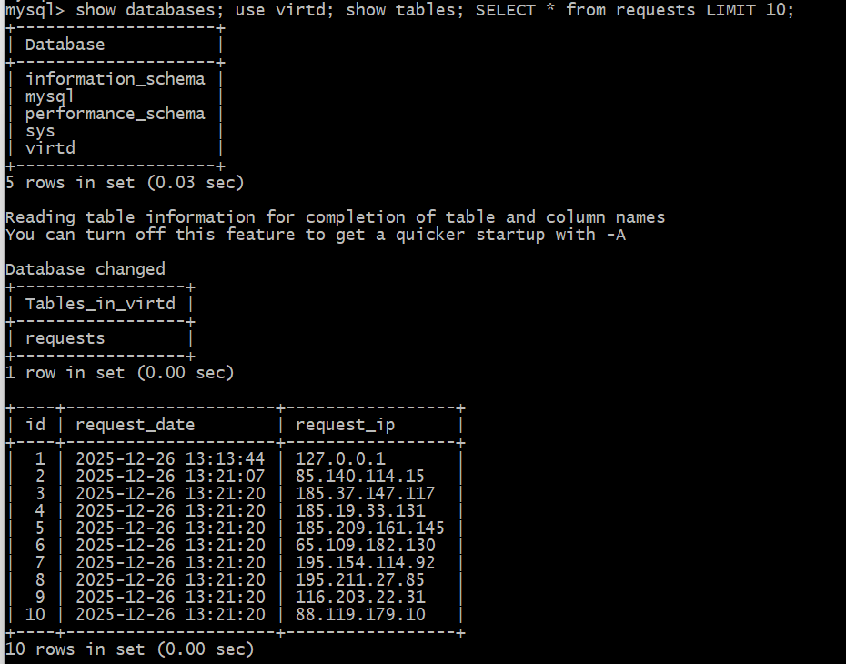

https://github.com/Dim223/shvirtd-example-python#

## Задача 5


## Задача 6
Скачайте docker образ hashicorp/terraform:latest и скопируйте бинарный файл /bin/terraform на свою локальную машину, используя dive и docker save. Предоставьте скриншоты действий .
```text
Устанавливаем dive и смотрим слои котейнера
dive hashicorp/terraform
```
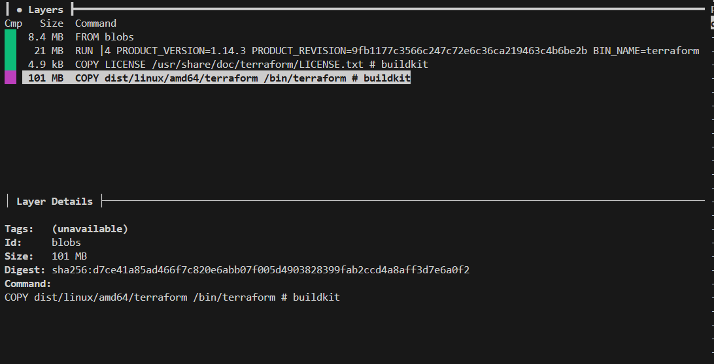
```text
Извлекаем в архив образ, ищем и распаковывам нужный слой.
```
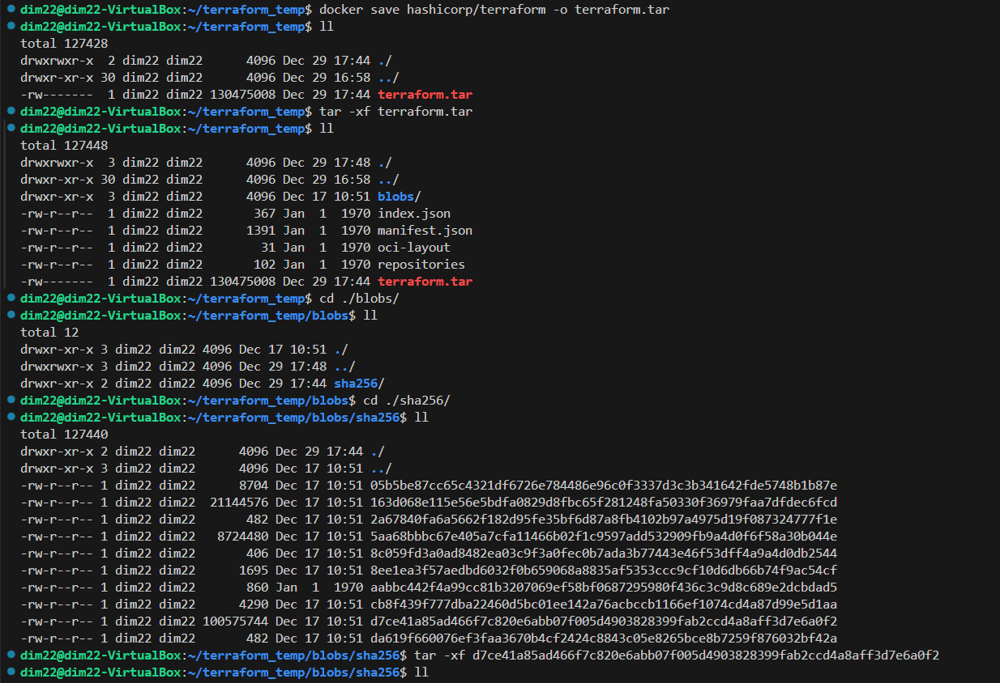
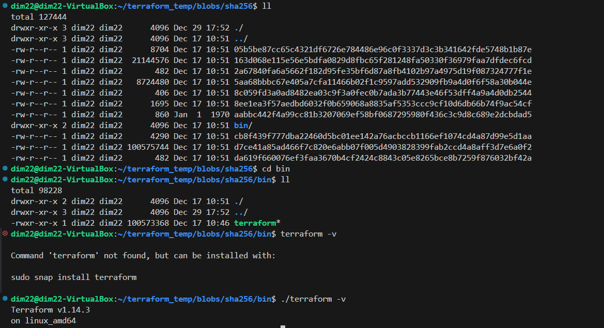

## Задача 6.1
Добейтесь аналогичного результата, используя docker cp.
Предоставьте скриншоты действий .
```text
Создадим контейнер из образа hashicorp/terraform и скопируем terraform из /bin
```
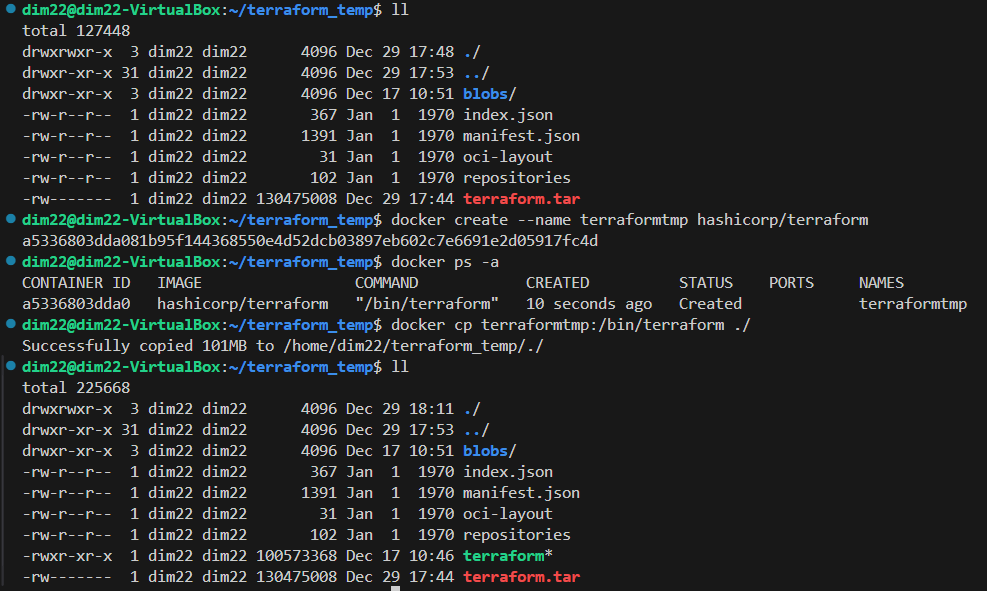

## Задача 6.2 (**)
Предложите способ извлечь файл из контейнера, используя только команду docker build и любой Dockerfile.
Предоставьте скриншоты действий .
```text
Воспользуемся multistage сборкой. Dockerfile:
```
```docker
FROM hashicorp/terraform AS builder

FROM scratch AS export
COPY --from=builder /bin/terraform /terraform
```
```bash
docker build  --output type=local,dest=$(pwd)/output -t terraform-exporter .
```
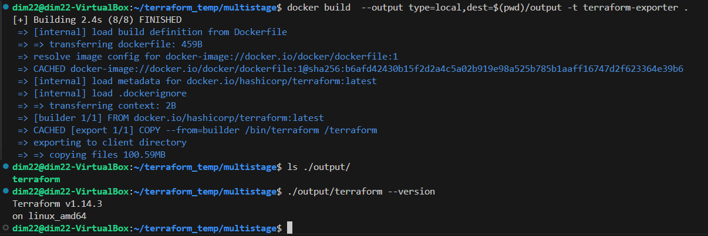