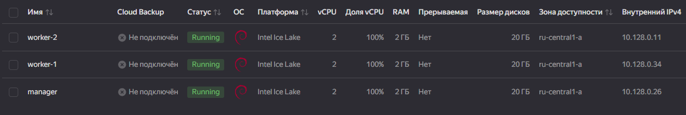
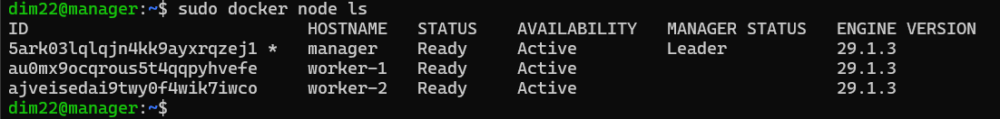

# Домашнее задание к занятию 6. «Оркестрация кластером Docker контейнеров на примере Docker Swarm»
## Задача 1
Создайте ваш первый Docker Swarm-кластер в Яндекс Облаке. Документация swarm: https://docs.docker.com/engine/reference/commandline/swarm_init/

1. Создайте 3 облачные виртуальные машины в одной сети.

2. Установите docker на каждую ВМ.
3. Создайте swarm-кластер из 1 мастера и 2-х рабочих нод.
4. Проверьте список нод командой:
```bash
docker node ls
```



