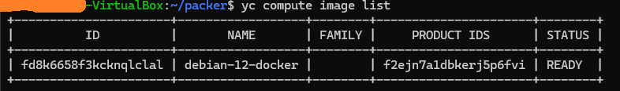
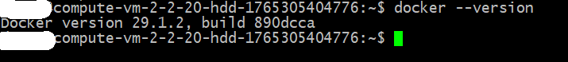

# 2. Применение принципов IaaC в работе с виртуальными машинами

## Задача 2
При запуске виртуальной машины возникает ошибка


Команду "vagrant box add bento/ubuntu-20.04" выполнил, не помогло.

## Задача 2
2. Образ в yandex cloud


3. Образ в командной строке yc cli


4. Созданная ВМ в облаке


5. Подключение по ssh и проверка установки docker


Результирующий файл mydebian.json.pkr.hcl
```hlc
source "yandex" "debian_docker" {
  disk_type           = "network-hdd"
  folder_id           = "XXXXXXXXXXXXXXXXXXXXXXXXX"
  image_description   = "my custom debian with docker"
  image_name          = "debian-12-docker"
  source_image_family = "debian-12"
  ssh_username        = "debian"
  subnet_id           = "e9b3g35us496417v4t6q"
  token               = "y0__XXXXXXXXXXXXXXXXXXXXXXXXXXXXXXXX"
  use_ipv4_nat        = true
  zone                = "ru-central1-a"
}

build {
  sources = ["source.yandex.debian_docker"]

  provisioner "shell" {
    inline = [
      "echo 'hello from packer'",
      "sudo apt update",
      "sudo apt install -y ca-certificates curl",
      "sudo install -m 0755 -d /etc/apt/keyrings",
      "sudo curl -fsSL https://download.docker.com/linux/debian/gpg -o /etc/apt/keyrings/docker.asc",
      "sudo chmod a+r /etc/apt/keyrings/docker.asc",
      "echo \"deb [arch=$(dpkg --print-architecture) signed-by=/etc/apt/keyrings/docker.asc] https://download.docker.com/linux/debian $(lsb_release -cs) stable\" | sudo tee /etc/apt/sources.list.d/docker.list > /dev/null",
      "sudo apt update",
      "sudo apt install -y docker-ce docker-ce-cli containerd.io docker-buildx-plugin docker-compose-plugin",
      "sudo sudo apt install -y htop",
      "sudo sudo apt install -y tmux"
    ]
  }

}

```