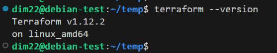
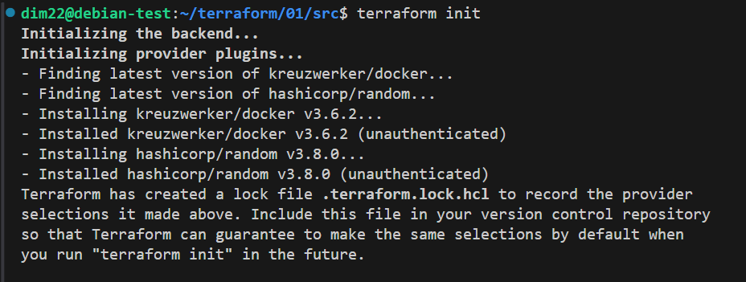
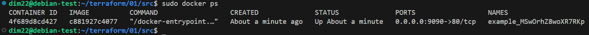
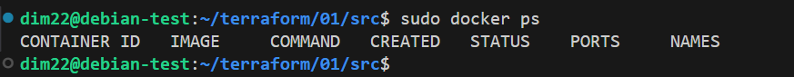
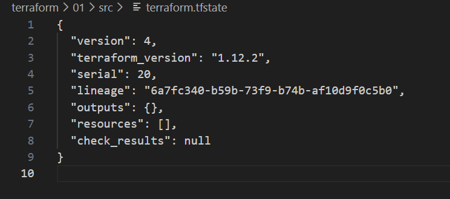
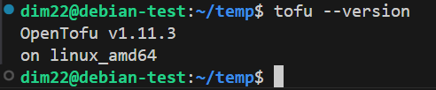
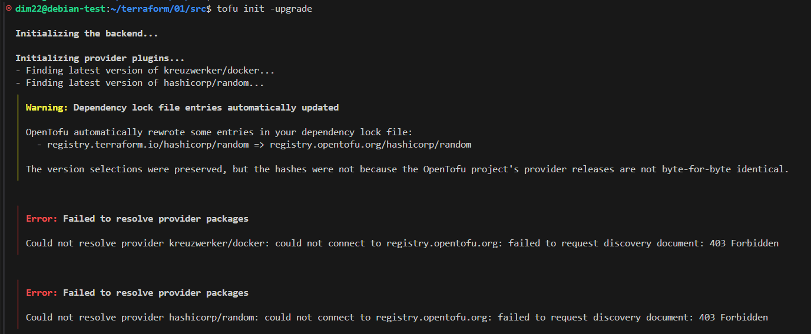

# 1. Введение в Terraform

Скачайте и установите Terraform версии >=1.12.0 . Приложите скриншот вывода команды terraform --version.

## Задание 1
1. Перейдите в каталог src. Скачайте все необходимые зависимости, использованные в проекте.

2. Изучите файл .gitignore. В каком terraform-файле, согласно этому .gitignore, допустимо сохранить личную, секретную информацию?(логины,пароли,ключи,токены итд)
```text
В файле personal.auto.tfvars
```
3. Выполните код проекта. Найдите в state-файле секретное содержимое созданного ресурса random_password, пришлите в качестве ответа конкретный ключ и его значение.
```text
"result": "MSwOrhZ8woXR7RKp",
```
4. Раскомментируйте блок кода, примерно расположенный на строчках 29–42 файла main.tf. Выполните команду terraform validate. Объясните, в чём заключаются намеренно допущенные ошибки. Исправьте их.
```text
В строке 'resource "docker_image" {' не хватает названия  "nginx"
В строке 'resource "docker_container" "1nginx" {' ошибочное название "1nginx"
В строке '  name  = "example_${random_password.random_string_FAKE.resulT}"' ошибочное название
```
5. Выполните код. В качестве ответа приложите: исправленный фрагмент кода и вывод команды docker ps.
```text
terraform {
  required_providers {
    docker = {
      source  = "kreuzwerker/docker"
      
    }
  }
#  required_version = "~>1.12.0" 
}
provider "docker" {}

#однострочный комментарий

resource "random_password" "random_string" {
  length      = 16
  special     = false
  min_upper   = 1
  min_lower   = 1
  min_numeric = 1
}

resource "docker_image" "nginx"{
  name         = "nginx:latest"
  keep_locally = true
}

resource "docker_container" "nginx" {
  image = docker_image.nginx.image_id
  name  = "example_${random_password.random_string.result}"

  ports {
    internal = 80
    external = 9090
  }
}

```

6. Замените имя docker-контейнера в блоке кода на hello_world. Не перепутайте имя контейнера и имя образа. Мы всё ещё продолжаем использовать name = "nginx:latest". Выполните команду terraform apply -auto-approve. Объясните своими словами, в чём может быть опасность применения ключа -auto-approve. Догадайтесь или нагуглите зачем может пригодиться данный ключ? В качестве ответа дополнительно приложите вывод команды docker ps.
```text
Автоматическое выполнение без проверки и подтверждения может привести к применению некорректных конфигураций.
Это может вызвать удаление ресурсов, конфликту настроек и т.д.
Ключ -auto-approve может пригодиться для запуска автоматизированных процедур, например CI/CD. 
Но только после успешного тестирования.
```


7. Уничтожьте созданные ресурсы с помощью terraform. Убедитесь, что все ресурсы удалены. Приложите содержимое файла terraform.tfstate.

8. Объясните, почему при этом не был удалён docker-образ nginx:latest. Ответ ОБЯЗАТЕЛЬНО НАЙДИТЕ В ПРЕДОСТАВЛЕННОМ КОДЕ, а затем ОБЯЗАТЕЛЬНО ПОДКРЕПИТЕ строчкой из документации terraform провайдера docker. (ищите в классификаторе resource docker_image )
```text
В блоке образа docker указан параметр хранить локально 'keep_locally = true'
"keep_locally (Boolean) If true, then the Docker image won't be deleted on destroy operation. If this is false, it will delete the image from the docker local storage on destroy operation."
```

## Задание 3
1. Установите opentofu(fork terraform с лицензией Mozilla Public License, version 2.0) любой версии

2. Попробуйте выполнить тот же код с помощью tofu apply, а не terraform apply.


```text
На текущий момент  OpenTofu приняли решение закрыть доступ к своему реестру с российских IP-адресов и удалить провайдеров российских облачных сервисов, таких как Yandex Cloud, Cloud.ru (бывший SberCloud) и Rustack Cloud Platform.
```