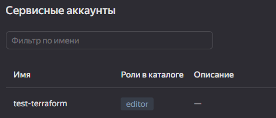
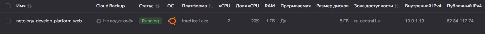
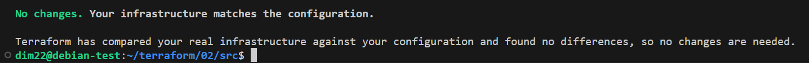
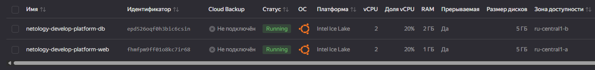
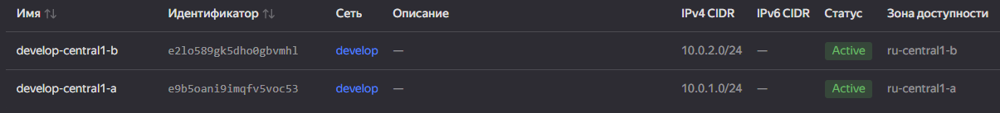
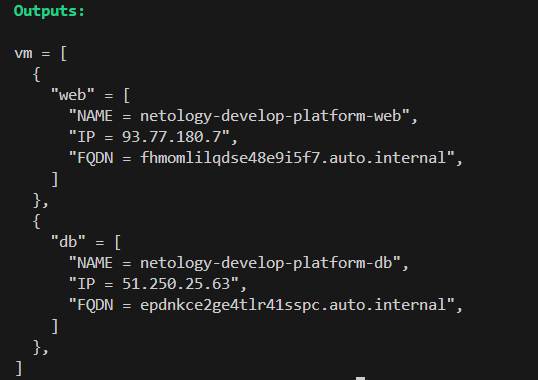
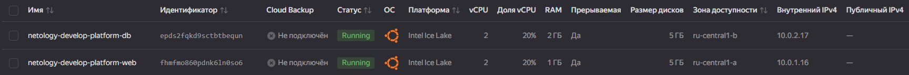
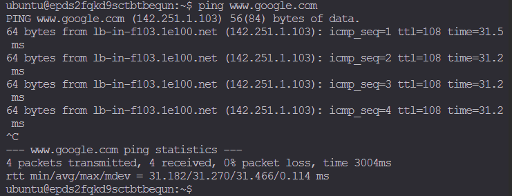
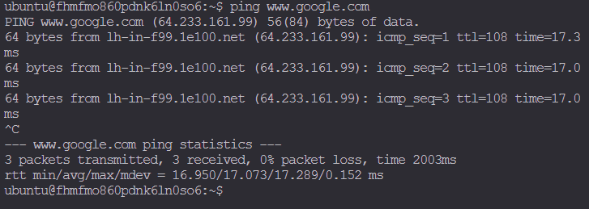

# 2. Основы Terraform. Yandex Cloud
## Задание 1
1. Изучите проект. В файле variables.tf объявлены переменные для Yandex provider.
2. Создайте сервисный аккаунт и ключ. service_account_key_file.

3. Сгенерируйте новый или используйте свой текущий ssh-ключ. Запишите его открытую(public) часть в переменную vms_ssh_public_root_key.
4. Инициализируйте проект, выполните код. Исправьте намеренно допущенные синтаксические ошибки. 
 Ищите внимательно, посимвольно. Ответьте, в чём заключается их суть.
 ```text
Строка <platform_id = "standart-v4"> В слове standart на конце должна быть буква d.
Следует из наименования вычислительнвх ресурсов Yandex Cloud.
Строка <cores         = 1>. Число процессоров и памяти должно быть кратно 2.
Следует из параметров создания вычислительнвх ресурсов Yandex Cloud.
```


5. Подключитесь к консоли ВМ через ssh и выполните команду  curl ifconfig.me.

6. Ответьте, как в процессе обучения могут пригодиться параметры preemptible = true и core_fraction=5 в параметрах ВМ
 ```text
Параметр "Прерываемая ВМ" позволяет существенно снизить стоимость ВМ и гарантировать ее отключение через 24 часа. Снижение параметра "Гарантированная доля vCPU" до 20% так же уменньшает стоимость ВМ.
```
## Задание 2
1. Замените все хардкод-значения для ресурсов yandex_compute_image и yandex_compute_instance на отдельные переменные. К названиям переменных ВМ добавьте в начало префикс vm_web_ . Пример: vm_web_name.
 ```hcl
data "yandex_compute_image" "ubuntu" {
  family = var.vm_web_image_family
}
resource "yandex_compute_instance" "platform" {
  name        = var.vm_web_instance_name
  platform_id = var.vm_web_instance_platform_id 
  resources {
    cores         = var.vm_web_instance_cores
    memory        = var.vm_web_instance_memory
    core_fraction = var.vm_web_instance_core_fraction
  }
  boot_disk {
    initialize_params {
      image_id = data.yandex_compute_image.ubuntu.image_id
    }
  }
  scheduling_policy {
    preemptible = var.vm_web_instance_preemptible
  }
  network_interface {
    subnet_id = yandex_vpc_subnet.develop.id
    nat       = var.vm_web_instance_network_interface_nat
  }

  metadata = {
    serial-port-enable = 1
    ssh-keys           = "ubuntu:${var.vms_ssh_root_key}"
  }

}
```
2. Объявите нужные переменные в файле variables.tf, обязательно указывайте тип переменной. Заполните их default прежними значениями из main.tf.
 ```hcl
###vm_web vars
variable "vm_web_image_family" {
  type        = string
  default     = "ubuntu-2004-lts"
  description = "image famaly"
}

variable "vm_web_instance_name" {
  type        = string
  default     = "netology-develop-platform-web"
  description = "instance name"
}

variable "vm_web_instance_platform_id" {
  type        = string
  default     = "standard-v3"
  description = "platform id"
}

variable "vm_web_instance_cores" {
  type        = number
  default     = 2
  description = "instance cores"
}

variable "vm_web_instance_memory" {
  type        = number
  default     = 1
  description = "instance memory"
}

variable "vm_web_instance_core_fraction" {
  type        = number
  default     = 20
  description = "instance core fraction"
}

variable "vm_web_instance_preemptible" {
  type        = bool
  default     = true
  description = "instance preemptible"
}

variable "vm_web_instance_network_interface_nat" {
  type        = bool
  default     = true
  description = "instance nat"
}
```
Проверьте terraform plan. Изменений быть не должно.


## Задание 3
1. Создайте в корне проекта файл 'vms_platform.tf' . Перенесите в него все переменные первой ВМ.
2. Скопируйте блок ресурса и создайте с его помощью вторую ВМ в файле main.tf: "netology-develop-platform-db" , cores  = 2, memory = 2, core_fraction = 20. Объявите её переменные с префиксом vm_db_ в том же файле ('vms_platform.tf'). ВМ должна работать в зоне "ru-central1-b"
3. Примените изменения.



## Задание 4
1. Объявите в файле outputs.tf один output , содержащий: instance_name, external_ip, fqdn для каждой из ВМ в удобном лично для вас формате.(без хардкода!!!)
2. Примените изменения.

В качестве решения приложите вывод значений ip-адресов команды terraform output
 ```text
"IP = 93.77.180.7"
"IP = 51.250.25.63"
```
## Задание 5
1. В файле locals.tf опишите в одном local-блоке имя каждой ВМ, используйте интерполяцию ${..} с НЕСКОЛЬКИМИ переменными по примеру из лекции.
2. Замените переменные внутри ресурса ВМ на созданные вами local-переменные.
3. Примените изменения.
 ```hcl
locals {
web_name = "${ var.instance_name }-${ var.web_instance_name }"
db_name  = "${ var.instance_name }-${ var.vm_db_instance_name }"
}
  ```
## Задание 6
1. Вместо использования трёх переменных ".._cores",".._memory",".._core_fraction" в блоке resources {...}, объедините их в единую map-переменную vms_resources и внутри неё конфиги обеих ВМ в виде вложенного map(object).
 ```hcl
variable "vms_resources" {
  type = map(map(number))
  default = {
    web={
      cores         = 2
      memory        = 1
      core_fraction = 20
    },
    db= {
      cores         = 2
      memory        = 2
      core_fraction = 20
    }
  }
}
  ```
2. Создайте и используйте отдельную map(object) переменную для блока metadata, она должна быть общая для всех ваших ВМ.
 ```hcl
variable "metadata" {
  type = map(string)
  default = {
    serial-port-enable = 1
    ssh-keys           = "ubuntu:ssh-rsa AAAAB3NzaC1......"
  }
}
  ```
3. Найдите и закоментируйте все, более не используемые переменные проекта.
4. Проверьте terraform plan. Изменений быть не должно.


## Задание 7*
1. Напишите, какой командой можно отобразить второй элемент списка test_list.
 ```hcl
> local.test_list[1]
"staging"
> 
  ```
2. Найдите длину списка test_list с помощью функции length(<имя переменной>).
 ```hcl
> length(local.test_list)
3
> 
  ```
3. Напишите, какой командой можно отобразить значение ключа admin из map test_map.
 ```hcl
> local.test_map.admin
"John"
>  
  ```
4. Напишите interpolation-выражение, результатом которого будет: "John is admin for production server based on OS ubuntu-20-04 with X vcpu, Y ram and Z virtual disks", используйте данные из переменных test_list, test_map, servers и функцию length() для подстановки значений.
 ```hcl
> "${ local.test_map.admin } is ${ keys(local.test_map)[0] } for ${ local.test_list[2] } server based on OS ${ local.servers.production.image } with ${ local.servers.production.cpu } vcpu, ${ local.servers.production.ram } ram and ${ length(local.servers.production.disks) } virtual disks"  
"John is admin for production server based on OS ubuntu-20-04 with 10 vcpu, 40 ram and 4 virtual disks"
>  
  ```
## Задание 8*
1. Напишите и проверьте переменную test и полное описание ее type в соответствии со значением из terraform.tfvars:
 ```hcl
  test = {
    default = {
      "dev1" = [
        "ssh -o 'StrictHostKeyChecking=no' ubuntu@62.84.124.117",
        "10.0.1.7"
      ],
      "dev2" = [
        "ssh -o 'StrictHostKeyChecking=no' ubuntu@84.252.140.88",
        "10.0.2.29"
      ],
      "prod1" = [
        "ssh -o 'StrictHostKeyChecking=no' ubuntu@51.250.2.101",
        "10.0.1.30"
      ]
    }
  }
  ```
2. Напишите выражение в terraform console, которое позволит вычленить строку "ssh -o 'StrictHostKeyChecking=no' ubuntu@62.84.124.117" из этой переменной.
 ```hcl
> local.test.default.dev1[0]
"ssh -o 'StrictHostKeyChecking=no' ubuntu@62.84.124.117"
>  
  ```

## Задание 9*
Используя инструкцию https://cloud.yandex.ru/ru/docs/vpc/operations/create-nat-gateway#tf_1, настройте для ваших ВМ nat_gateway. Для проверки уберите внешний IP адрес (nat=false) у ваших ВМ и проверьте доступ в интернет с ВМ, подключившись к ней через serial console. Для подключения предварительно через ssh измените пароль пользователя: sudo passwd ubuntu
 ```hcl
resource "yandex_vpc_gateway" "nat_gateway" {
  folder_id      = var.folder_id
  name           = "${ var.vpc_name }-gateway"
  shared_egress_gateway {}
}

resource "yandex_vpc_route_table" "rt" {
  folder_id  = var.folder_id
  name       = "${ var.vpc_name }-route-table" 
  network_id = yandex_vpc_network.develop.id

  static_route {
    destination_prefix = "0.0.0.0/0"
    gateway_id         = yandex_vpc_gateway.nat_gateway.id
  }
}
  ```





[Ссылка на код](src/)

