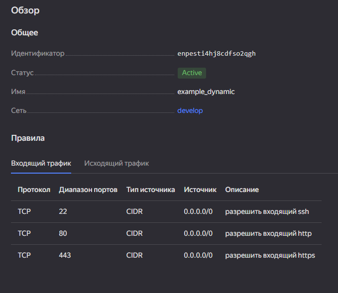
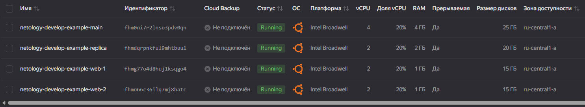
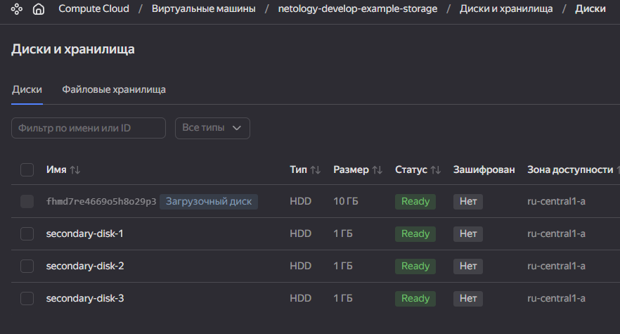
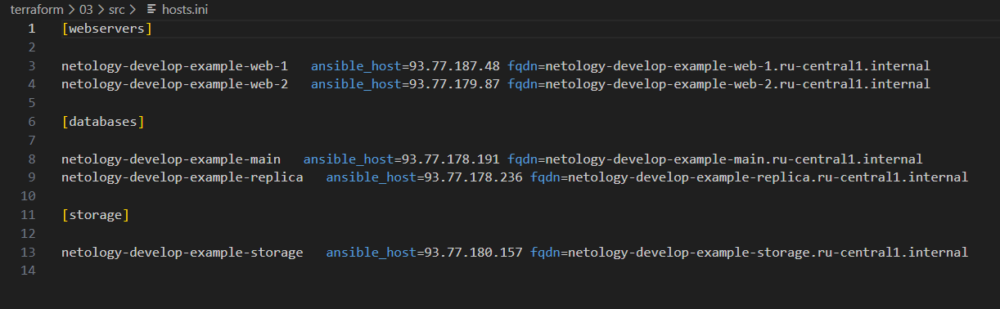
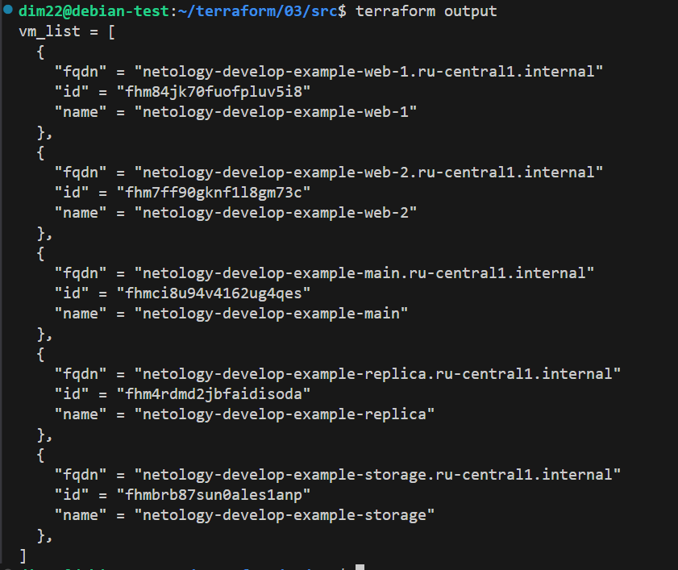

# 3. Управляющие конструкции в коде Terraform
## Задание 1
1. Изучите проект.
2. Инициализируйте проект, выполните код.
Приложите скриншот входящих правил «Группы безопасности» в ЛК Yandex Cloud


## Задание 2
1. Создайте файл count-vm.tf. Опишите в нём создание двух одинаковых ВМ web-1 и web-2 (не web-0 и web-1) с минимальными параметрами, используя мета-аргумент count loop. Назначьте ВМ созданную в первом задании группу безопасности.(как это сделать узнайте в документации провайдера yandex/compute_instance ) 

[count-vm.tf](src/count-vm.tf)

2. Создайте файл for_each-vm.tf. Опишите в нём создание двух ВМ для баз данных с именами "main" и "replica" разных по cpu/ram/disk_volume , используя мета-аргумент for_each loop. Используйте для обеих ВМ одну общую переменную типа:
variable "each_vm" {
  type = list(object({  vm_name=string, cpu=number, ram=number, disk_volume=number }))
}
При желании внесите в переменную все возможные параметры. 

[for_each-vm.tf](src/for_each-vm.tf)

3. ВМ из пункта 2.1 должны создаваться после создания ВМ из пункта 2.2. 
4. Используйте функцию file в local-переменной для считывания ключа ~/.ssh/id_rsa.pub и его последующего использования в блоке metadata, взятому из ДЗ 2. 
5. Инициализируйте проект, выполните код.


## Задание 3
1. Создайте 3 одинаковых виртуальных диска размером 1 Гб с помощью ресурса yandex_compute_disk и мета-аргумента count в файле disk_vm.tf .
2. Создайте в том же файле одиночную(использовать count или for_each запрещено из-за задания №4) ВМ c именем "storage" . Используйте блок dynamic secondary_disk{..} и мета-аргумент for_each для подключения созданных вами дополнительных дисков.

[disk_vm.tf](src/disk_vm.tf)

## Задание 4
1. В файле ansible.tf создайте inventory-файл для ansible. Используйте функцию tepmplatefile и файл-шаблон для создания ansible inventory-файла из лекции. Готовый код возьмите из демонстрации к лекции demonstration2. Передайте в него в качестве переменных группы виртуальных машин из задания 2.1, 2.2 и 3.2, т. е. 5 ВМ.
2. Инвентарь должен содержать 3 группы и быть динамическим, т. е. обработать как группу из 2-х ВМ, так и 999 ВМ.
3. Добавьте в инвентарь переменную fqdn.
```txt
[webservers]
web-1 ansible_host=<внешний ip-адрес> fqdn=<полное доменное имя виртуальной машины>
web-2 ansible_host=<внешний ip-адрес> fqdn=<полное доменное имя виртуальной машины>

[databases]
main ansible_host=<внешний ip-адрес> fqdn=<полное доменное имя виртуальной машины>
replica ansible_host<внешний ip-адрес> fqdn=<полное доменное имя виртуальной машины>

[storage]
storage ansible_host=<внешний ip-адрес> fqdn=<полное доменное имя виртуальной машины>
```
Пример fqdn: web1.ru-central1.internal(в случае указания переменной hostname(не путать с переменной name)); fhm8k1oojmm5lie8i22a.auto.internal(в случае отсутвия перменной hostname - автоматическая генерация имени, зона изменяется на auto). нужную вам переменную найдите в документации провайдера или terraform console.

[ansible.tf](src/ansible.tf)

[hosts.tftpl](src/hosts.tftpl)

4. Выполните код. Приложите скриншот получившегося файла.


## Задание 5*
Напишите output, который отобразит ВМ из ваших ресурсов count и for_each в виде списка словарей :
```hcl
[
 {
  "name" = 'имя ВМ1'
  "id"   = 'идентификатор ВМ1'
  "fqdn" = 'Внутренний FQDN ВМ1'
 },
 {
  "name" = 'имя ВМ2'
  "id"   = 'идентификатор ВМ2'
  "fqdn" = 'Внутренний FQDN ВМ2'
 },
 ....
...итд любое количество ВМ в ресурсе(те требуется итерация по ресурсам, а не хардкод) !!!!!!!!!!!!!!!!!!!!!
]
```
Приложите скриншот вывода команды terrafrom output

[outputs.tf](src/outputs.tf)


## Задание 8* 
Идентифицируйте и устраните намеренно допущенную в tpl-шаблоне ошибку. Обратите внимание, что terraform сам сообщит на какой строке и в какой позиции ошибка!
```hcl
[webservers]
%{~ for i in webservers ~}
${i["name"]} ansible_host=${i["network_interface"][0]["nat_ip_address"] platform_id=${i["platform_id "]}}
%{~ endfor ~}
```
```txt
В строке ${i["name"]} ansible_host=${i["network_interface"][0]["nat_ip_address"] platform_id=${i["platform_id "]}}
одну из скобок после ["platform_id "] надо перенести после ["nat_ip_address"] (закрытие переменной)
В ["platform_id "] лишний пробел.
Исправленная строкаЖ
 ${i["name"]} ansible_host=${i["network_interface"][0]["nat_ip_address"]
  } platform_id=${i["platform_id"]}

```