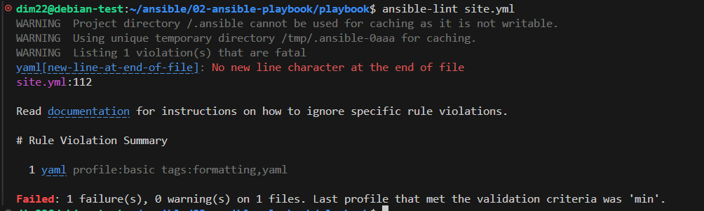
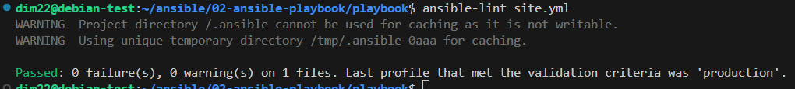
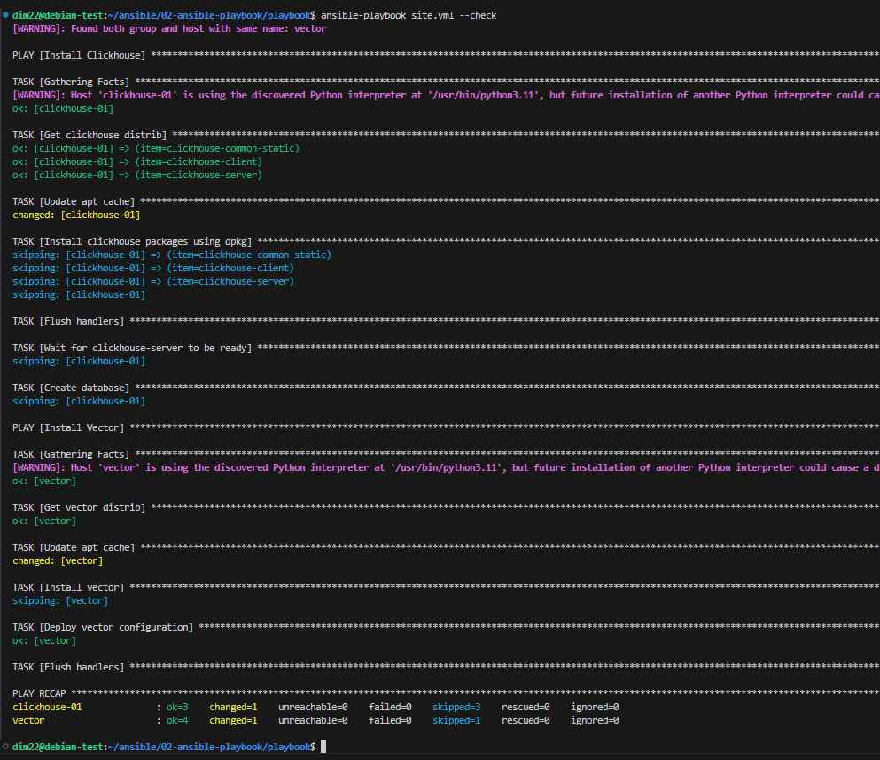
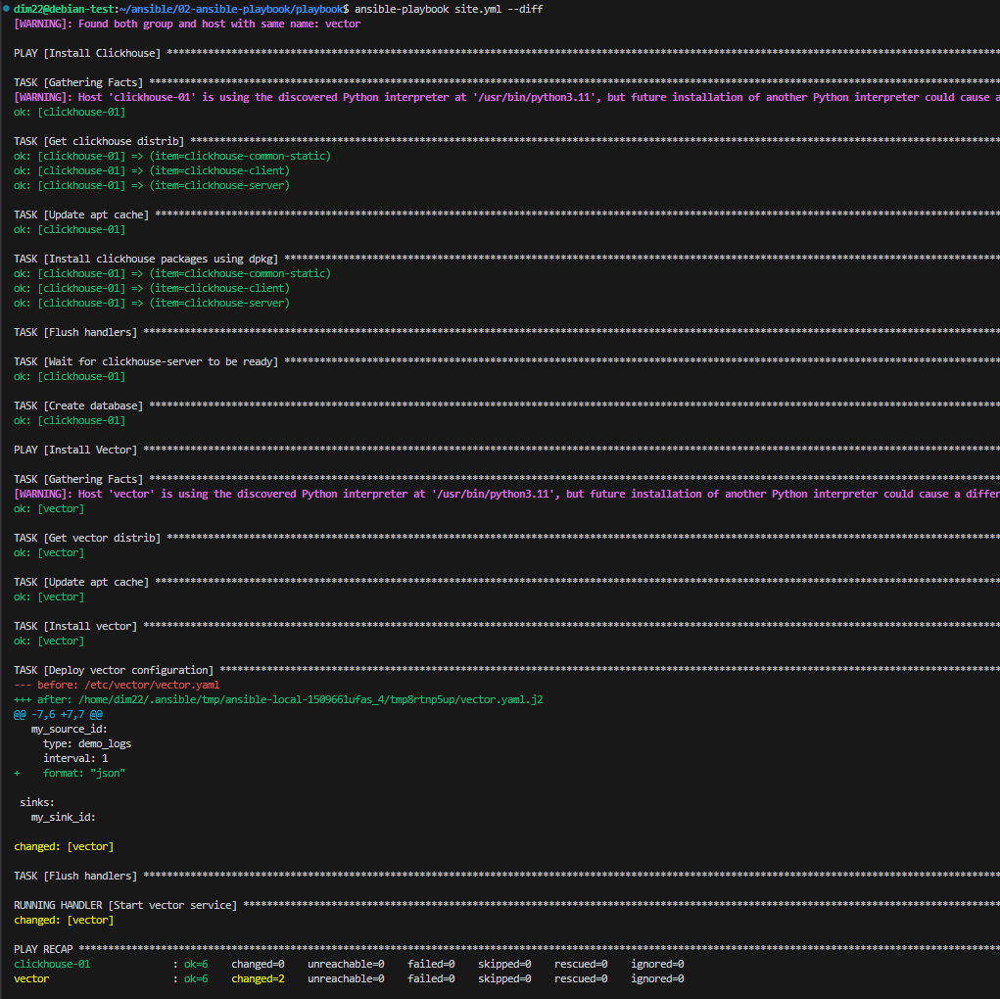
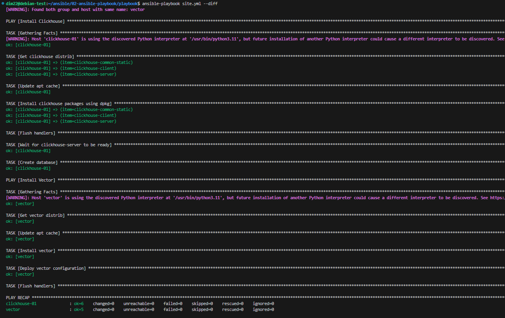

# Работа с Playbook
## 1 Основная часть
1. Подготовьте свой inventory-файл prod.yml.
2. Допишите playbook: нужно сделать ещё один play, который устанавливает и настраивает vector. 
3. Конфигурация vector должна деплоиться через template файл jinja2. От вас не требуется использовать все возможности шаблонизатора, просто вставьте стандартный конфиг в template файл. Информация по шаблонам по ссылке. не забудьте сделать handler на перезапуск vector в случае изменения конфигурации!
4. При создании tasks рекомендую использовать модули: get_url, template, unarchive, file.
Tasks должны: скачать дистрибутив нужной версии, выполнить распаковку в выбранную директорию, установить vector.
5. Запустите ansible-lint site.yml и исправьте ошибки, если они есть.
6. Попробуйте запустить playbook на этом окружении с флагом --check.
7. Запустите playbook на prod.yml окружении с флагом --diff. Убедитесь, что изменения на системе произведены.
8. Повторно запустите playbook с флагом --diff и убедитесь, что playbook идемпотентен.
9. Подготовьте README.md-файл по своему playbook. В нём должно быть описано: что делает playbook, какие у него есть параметры и теги. Пример качественной документации ansible playbook по ссылке. Так же приложите скриншоты выполнения заданий №5-8
10. Готовый playbook выложите в свой репозиторий, поставьте тег 08-ansible-02-playbook на фиксирующий коммит, в ответ предоставьте ссылку на него.

## 2 Решение 

## 2 Описание плейбука
Этот плейбук выполняет установку и настройку ClickHouse и Vector на соответствующих хостах, скачивает необходимые пакеты, устанавливает их, настраивает конфигурационные файлы и управляет службами.

### Установка и настройка ClickHouse
#### Параметры
hosts: clickhouse 
become: true 

#### Хэндлеры
Start clickhouse service 
Перезапускает службу ClickHouse 
Теги: clickhouse, start service 

#### Задачи
* Get clickhouse distrib 
  Скачивает дистрибутивы ClickHouse для архитектуры AMD64 
  Теги: clickhouse, distr 

* Update apt cache 
Обновляет кэш APT 

* *nstall clickhouse packages using dpkg 
Устанавливает пакеты ClickHouse с использованием dpkg 
Теги: clickhouse, install 
Notify: Start clickhouse service 

* Flush handlers 
Выполняет все отложенные хэндлеры 
Теги: clickhouse, start service 

* Wait for clickhouse-server to be ready 
Ожидает, пока сервер ClickHouse станет доступен на порту 9000 
Теги: clickhouse, wait 

* Create database 
Создает базу данных logs в ClickHouse 
Теги: clickhouse, db 

### Установка и настройка Vector
#### Параметры
hosts: vector 
become: true 

#### Хэндлеры
Start vector service 
Перезапускает службу Vector 
Теги: vector, restartservice 

#### Задачи
* Get vector distrib 
Скачивает дистрибутив Vector для архитектуры AMD64 
Теги: vector, distr 

* Update apt cache 
Обновляет кэш APT 

* Install vector 
Устанавливает пакет Vector с использованием dpkg 
Теги: vector, install 

* Deploy vector configuration 
Развертывает конфигурационный файл Vector с использованием шаблона Jinja2 
Теги: vector, config 
Notify: Start vector service 

* Flush handlers 
Выполняет все отложенные хэндлеры 
Теги: vector, restart service 

### Переменные
clickhouse_version: Версия ClickHouse для установки 
clickhouse_packages: Список пакетов ClickHouse для установки 
vector_version: Версия Vector для установки. 
vector_config_path: Путь для конфигурационного файла Vector 
