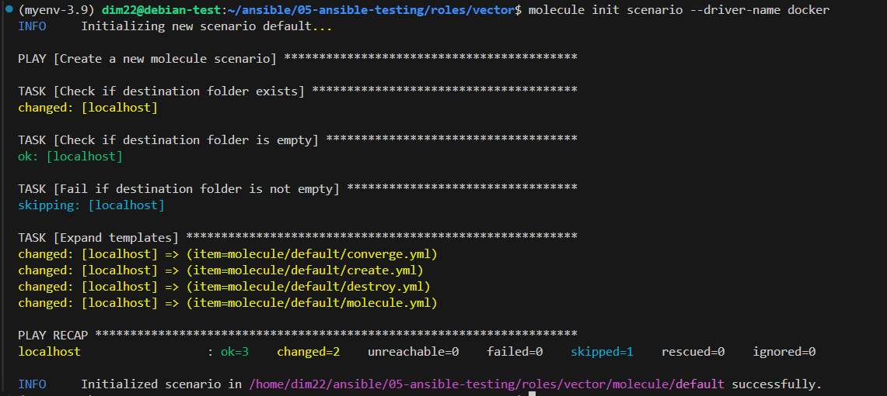
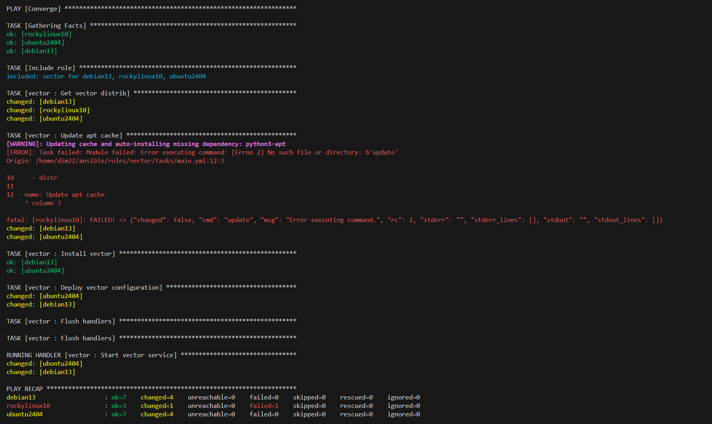
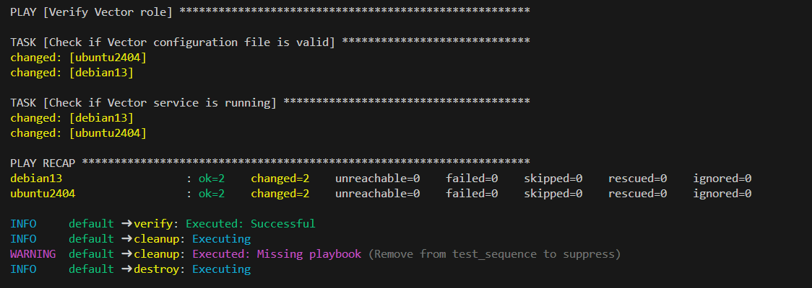
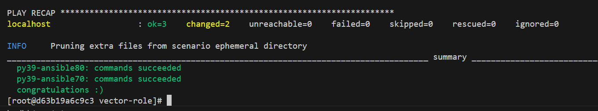

# Тестирование roles
## Основная часть
### Molecule
1. Запустите molecule test -s ubuntu_xenial (или с любым другим сценарием, не имеет значения) внутри корневой директории clickhouse-role, посмотрите на вывод команды. Данная команда может отработать с ошибками или не отработать вовсе, это нормально. Наша цель - посмотреть как другие в реальном мире используют молекулу И из чего может состоять сценарий тестирования.</br>
2. Перейдите в каталог с ролью vector-role и создайте сценарий тестирования по умолчанию при помощи molecule init scenario --driver-name docker.</br>

3. Добавьте несколько разных дистрибутивов (oraclelinux:8, ubuntu:latest) для инстансов и протестируйте роль, исправьте найденные ошибки, если они есть.

```
Ошибка с rockylinux ожидаема, т.к. роль писалась для debian систем.
```
4. Добавьте несколько assert в verify.yml-файл для проверки работоспособности vector-role (проверка, что конфиг валидный, проверка успешности запуска и др.).
5. Запустите тестирование роли повторно и проверьте, что оно прошло успешно.
 

[Ссылка на полный лог molecule test](images/molecule.log)</br>
[Тег 1.0.2](https://github.com/Dim223/DevOps-engineer/tree/1.0.2/3-configuration-management/05-ansible-testing)</br>


1. Добавьте новый тег на коммит с рабочим сценарием в соответствии с семантическим версионированием.
### Tox
1. Добавьте в директорию с vector-role файлы из директории.
2. Запустите docker run --privileged=True -v <path_to_repo>:/opt/vector-role -w /opt/vector-role -it aragast/netology:latest /bin/bash, где path_to_repo — путь до корня репозитория с vector-role на вашей файловой системе.
3. Внутри контейнера выполните команду tox, посмотрите на вывод.
4. Создайте облегчённый сценарий для molecule с драйвером molecule_podman. Проверьте его на исполнимость.
5. Пропишите правильную команду в tox.ini, чтобы запускался облегчённый сценарий.
6. Запустите команду tox. Убедитесь, что всё отработало успешно.
 

[Ссылка на полный лог tox](images/tox.log)</br>
[Тег 1.0.3]([images/tox.log](https://github.com/Dim223/DevOps-engineer/tree/1.0.3/3-configuration-management/05-ansible-testing))</br>

1. Добавьте новый тег на коммит с рабочим сценарием в соответствии с семантическим версионированием.
После выполнения у вас должно получится два сценария molecule и один tox.ini файл в репозитории. Не забудьте указать в ответе теги решений Tox и Molecule заданий. В качестве решения пришлите ссылку на ваш репозиторий и скриншоты этапов выполнения задания.
